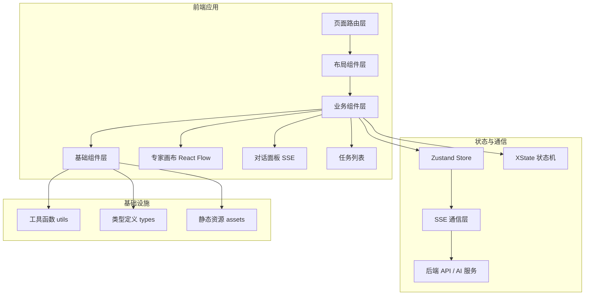

# RiskMonitor-FrontEnd

> 一个纯前端 MultiAgent（多智能体）协作平台，灵感来自 Qoder 专家团模式，实现多智能体任务编排、实时对话流与可视化协作画布。

## 核心特性

- **多智能体编排** — 支持 Lead Agent 统一调度，多个专家角色（调研员、全栈工程师、QA、代码审查员、UI 操作者）协同工作
- **专家团画布** — 基于 React Flow 的可视化画布，直观展示智能体之间的依赖关系与任务流转
- **实时任务流** — 通过 SSE（Server-Sent Events）实现流式对话与任务状态实时推送
- **上下文隔离** — 每个智能体拥有独立的上下文空间，避免跨角色信息污染
- **产物流水线** — 智能体产出物（Artifact）的结构化管理和版本追踪
- **状态机驱动** — 基于 XState 建模专家工作流，确保任务状态转换的可靠性
- **类型安全** — 全栈 TypeScript，从数据模型到组件 Props 的端到端类型保障

## 技术栈

| 类别 | 技术 | 版本 | 说明 |
|------|------|------|------|
| 核心框架 | React | 19 | UI 构建基础框架 |
| 类型系统 | TypeScript | 6 | 静态类型检查 |
| 构建工具 | Vite | 8 | 极速开发服务器与构建 |
| 代码检查 | Oxlint | 1.71+ | 高性能 Linter |
| 状态管理 | Zustand | 5（规划中） | 轻量全局状态管理 |
| 画布可视化 | React Flow | 12（规划中） | 专家团可视化画布 |
| 状态机 | XState | 5（规划中） | 专家工作流状态建模 |
| 路由 | React Router | 7（规划中） | 客户端路由管理 |
| HTTP 通信 | 原生 SSE + Fetch | - | 实时通信与接口请求 |
| 包管理 | npm | 10+ | 依赖管理 |

## 项目架构



## 快速开始

### 环境要求

- **Node.js** >= 20.0.0
- **npm** >= 10.0.0（或 pnpm >= 9.0.0）

### 安装与启动

```bash
# 克隆仓库
git clone <repository-url>
cd RiskMonitor-FrontEnd

# 安装依赖
npm install

# 启动开发服务器（默认 http://localhost:5173）
npm run dev

# 构建生产版本
npm run build

# 预览生产构建
npm run preview

# 代码检查
npm run lint
```

## 项目结构

```
RiskMonitor-FrontEnd/
├── public/                  # 静态公共资源
├── src/
│   ├── assets/              # 静态资源（图片、字体等）
│   ├── components/          # 可复用组件
│   │   ├── base/            # 基础组件
│   │   ├── layout/          # 布局组件
│   │   └── business/        # 业务组件
│   ├── pages/               # 页面组件
│   ├── hooks/               # 自定义 Hooks
│   ├── store/               # Zustand 状态管理
│   ├── api/                 # API 通信层（SSE、HTTP 封装）
│   ├── utils/               # 工具函数
│   ├── types/               # TypeScript 类型定义
│   └── main.tsx             # 应用入口
├── docs/                    # 项目文档
│   ├── architecture/        # 架构文档
│   ├── guides/              # 开发指南
│   ├── standards/           # 开发规范
│   └── decisions/           # 架构决策记录（ADR）
├── index.html               # HTML 入口
├── vite.config.ts           # Vite 配置
├── tsconfig.json            # TypeScript 配置
├── .oxlintrc.json           # Oxlint 配置
└── package.json             # 项目依赖与脚本
```

## 文档导航

| 文档 | 路径 | 说明 |
|------|------|------|
| 文档导航入口 | [docs/README.md](docs/README.md) | 文档体系总览 |
| 架构概览 | [docs/architecture/overview.md](docs/architecture/overview.md) | 系统总体架构设计 |
| 前端架构 | [docs/architecture/frontend.md](docs/architecture/frontend.md) | 前端模块详细设计 |
| 数据模型 | [docs/architecture/data-model.md](docs/architecture/data-model.md) | 核心类型与数据结构 |
| 环境搭建 | [docs/guides/setup.md](docs/guides/setup.md) | 开发环境配置指南 |
| 开发流程 | [docs/guides/development.md](docs/guides/development.md) | 日常开发工作流 |
| 编码规范 | [docs/standards/coding-conventions.md](docs/standards/coding-conventions.md) | 代码风格与规范 |
| 测试规范 | [docs/standards/testing.md](docs/standards/testing.md) | 测试策略与规范 |
| 技术栈选型 | [docs/decisions/0001-tech-stack-selection.md](docs/decisions/0001-tech-stack-selection.md) | ADR: 技术栈决策 |
| 前端架构决策 | [docs/decisions/0002-multiagent-frontend-architecture.md](docs/decisions/0002-multiagent-frontend-architecture.md) | ADR: MultiAgent 架构 |
| AI 协作指南 | [AGENTS.md](AGENTS.md) | AI 编程助手协作说明 |
| 贡献指南 | [CONTRIBUTING.md](CONTRIBUTING.md) | 参与贡献流程 |
| 更新日志 | [CHANGELOG.md](CHANGELOG.md) | 版本更新记录 |

## 开源协议

本项目采用 [MIT](LICENSE) 协议。
# React + TypeScript + Vite

This template provides a minimal setup to get React working in Vite with HMR and some Oxlint rules.

Currently, two official plugins are available:

- [@vitejs/plugin-react](https://github.com/vitejs/vite-plugin-react/blob/main/packages/plugin-react) uses [Oxc](https://oxc.rs)
- [@vitejs/plugin-react-swc](https://github.com/vitejs/vite-plugin-react/blob/main/packages/plugin-react-swc) uses [SWC](https://swc.rs/)

## React Compiler

The React Compiler is not enabled on this template because of its impact on dev & build performances. To add it, see [this documentation](https://react.dev/learn/react-compiler/installation).

## Expanding the Oxlint configuration

If you are developing a production application, we recommend enabling type-aware lint rules by installing `oxlint-tsgolint` and editing `.oxlintrc.json`:

```json
{
  "$schema": "./node_modules/oxlint/configuration_schema.json",
  "plugins": ["react", "typescript", "oxc"],
  "options": {
    "typeAware": true
  },
  "rules": {
    "react/rules-of-hooks": "error",
    "react/only-export-components": ["warn", { "allowConstantExport": true }]
  }
}
```

See the [Oxlint rules documentation](https://oxc.rs/docs/guide/usage/linter/rules) for the full list of rules and categories.
