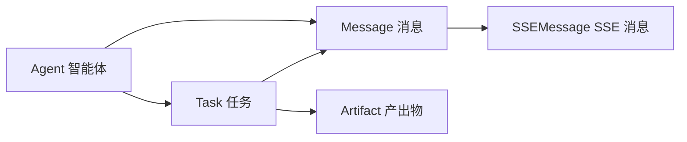

# 数据模型

> RiskMonitor-FrontEnd 核心数据类型定义文档。本文定义了项目中所有关键实体、枚举和 Store 状态结构。

## 核心类型总览



## 专家角色枚举

```typescript
// types/agent.ts

/** 专家角色类型 */
type AgentRole =
  | 'lead'         // Lead Agent，统一调度
  | 'researcher'   // 调研员
  | 'engineer'     // 全栈工程师
  | 'qa'           // QA 测试工程师
  | 'reviewer'     // 代码审查员
  | 'ui_operator'  // UI 操作者

/** 智能体运行状态 */
type AgentStatus = 'idle' | 'assigned' | 'working' | 'completed' | 'failed' | 'cancelled'
```

## 任务状态枚举

```typescript
// types/task.ts

/** 任务状态 */
type TaskStatus =
  | 'pending'     // 等待分配
  | 'in_progress' // 执行中
  | 'completed'   // 已完成
  | 'failed'      // 失败
  | 'cancelled'   // 已取消

/** 任务优先级 */
type TaskPriority = 'low' | 'medium' | 'high' | 'critical'
```

## 消息类型定义

### SSE 消息类型枚举

```typescript
// types/message.ts

/** SSE 消息类型 */
type SSEMessageType =
  | 'agent_status'   // 智能体状态变更
  | 'token_stream'   // 流式 token 输出
  | 'task_update'    // 任务状态更新
  | 'artifact'       // 产出物通知
  | 'error'          // 错误通知
```

### 消息接口定义

```typescript
// types/message.ts

/** SSE 消息基础接口 */
interface SSEMessage {
  type: SSEMessageType
  timestamp: number
  agentId?: string
  taskId?: string
  payload: unknown
}

/** 智能体状态消息 */
interface AgentStatusMessage extends SSEMessage {
  type: 'agent_status'
  payload: {
    agentId: string
    role: AgentRole
    status: AgentStatus
    currentTaskId?: string
  }
}

/** 流式 Token 消息 */
interface TokenStreamMessage extends SSEMessage {
  type: 'token_stream'
  payload: {
    messageId: string
    token: string
    sequence: number
  }
}

/** 任务更新消息 */
interface TaskUpdateMessage extends SSEMessage {
  type: 'task_update'
  payload: {
    taskId: string
    status: TaskStatus
    progress?: number
    result?: string
  }
}

/** 产出物消息 */
interface ArtifactMessage extends SSEMessage {
  type: 'artifact'
  payload: {
    artifactId: string
    taskId: string
    artifactType: ArtifactType
    content: string
    metadata?: Record<string, unknown>
  }
}

/** 错误消息 */
interface ErrorMessage extends SSEMessage {
  type: 'error'
  payload: {
    code: string
    message: string
    retryable: boolean
  }
}
```

## 核心实体定义

### Agent 智能体

```typescript
// types/agent.ts

interface Agent {
  id: string
  role: AgentRole
  name: string
  status: AgentStatus
  avatar?: string
  currentTaskId?: string
  capabilities: string[]
  createdAt: number
  lastActiveAt: number
}
```

### Task 任务

```typescript
// types/task.ts

interface Task {
  id: string
  title: string
  description: string
  status: TaskStatus
  priority: TaskPriority
  assignedAgentId?: string
  assignedRole?: AgentRole
  dependencies: string[]          // 依赖的任务 ID 列表
  artifacts: Artifact[]           // 关联的产出物
  subtasks: string[]              // 子任务 ID 列表
  createdAt: number
  startedAt?: number
  completedAt?: number
  errorMessage?: string
}
```

### Message 对话消息

```typescript
// types/message.ts

/** 对话消息来源 */
type MessageSource = 'user' | 'agent' | 'system'

/** 对话消息 */
interface Message {
  id: string
  source: MessageSource
  agentRole?: AgentRole           // 来源智能体角色（agent 消息时有值）
  content: string
  isStreaming: boolean            // 是否正在流式传输
  timestamp: number
  metadata?: {
    taskId?: string
    artifactId?: string
    tokens?: number               // token 数量
  }
}
```

### Artifact 产出物

```typescript
// types/task.ts

/** 产出物类型 */
type ArtifactType =
  | 'code'          // 代码文件
  | 'report'        // 调研报告
  | 'test_result'   // 测试结果
  | 'review'        // 审查意见
  | 'screenshot'    // 截图
  | 'diff'          // 代码差异
  | 'document'      // 文档

/** 产出物 */
interface Artifact {
  id: string
  taskId: string
  type: ArtifactType
  title: string
  content: string
  version: number
  metadata?: Record<string, unknown>
  createdAt: number
  updatedAt: number
}
```

## Store 状态结构定义

### Chat Store

```typescript
interface ChatState {
  messages: Message[]
  streamingMessageId: string | null
  isStreaming: boolean
  error: string | null
}
```

### Task Store

```typescript
interface TaskState {
  tasks: Record<string, Task>        // 以 ID 为键的任务映射
  taskOrder: string[]                // 任务展示顺序
  activeTaskId: string | null        // 当前关注的任务
  filter: TaskStatus | 'all'         // 状态过滤
}
```

### Canvas Store

```typescript
interface CanvasState {
  nodes: CanvasNode[]                // 画布节点
  edges: CanvasEdge[]                // 画布连线
  selectedNodeId: string | null      // 当前选中节点
  viewport: { x: number; y: number; zoom: number }
}

interface CanvasNode {
  id: string
  agentId: string
  role: AgentRole
  position: { x: number; y: number }
  data: { status: AgentStatus; taskCount: number }
}

interface CanvasEdge {
  id: string
  source: string
  target: string
  label?: string
}
```

### Agent Store

```typescript
interface AgentStoreState {
  agents: Record<string, Agent>      // 以 ID 为键的智能体映射
  activeAgentIds: string[]           // 活跃智能体列表
  leadAgentId: string | null         // Lead Agent ID
}
```

## 类型导出汇总

所有类型通过 `types/index.ts` 统一导出：

```typescript
// types/index.ts
export type { Agent, AgentRole, AgentStatus } from './agent'
export type { Task, TaskStatus, TaskPriority, Artifact, ArtifactType } from './task'
export type {
  Message,
  MessageSource,
  SSEMessage,
  SSEMessageType,
  AgentStatusMessage,
  TokenStreamMessage,
  TaskUpdateMessage,
  ArtifactMessage,
  ErrorMessage,
} from './message'
```

前端架构与组件设计详见 [前端架构详解](frontend.md)，架构总体设计详见 [架构概览](overview.md)。
