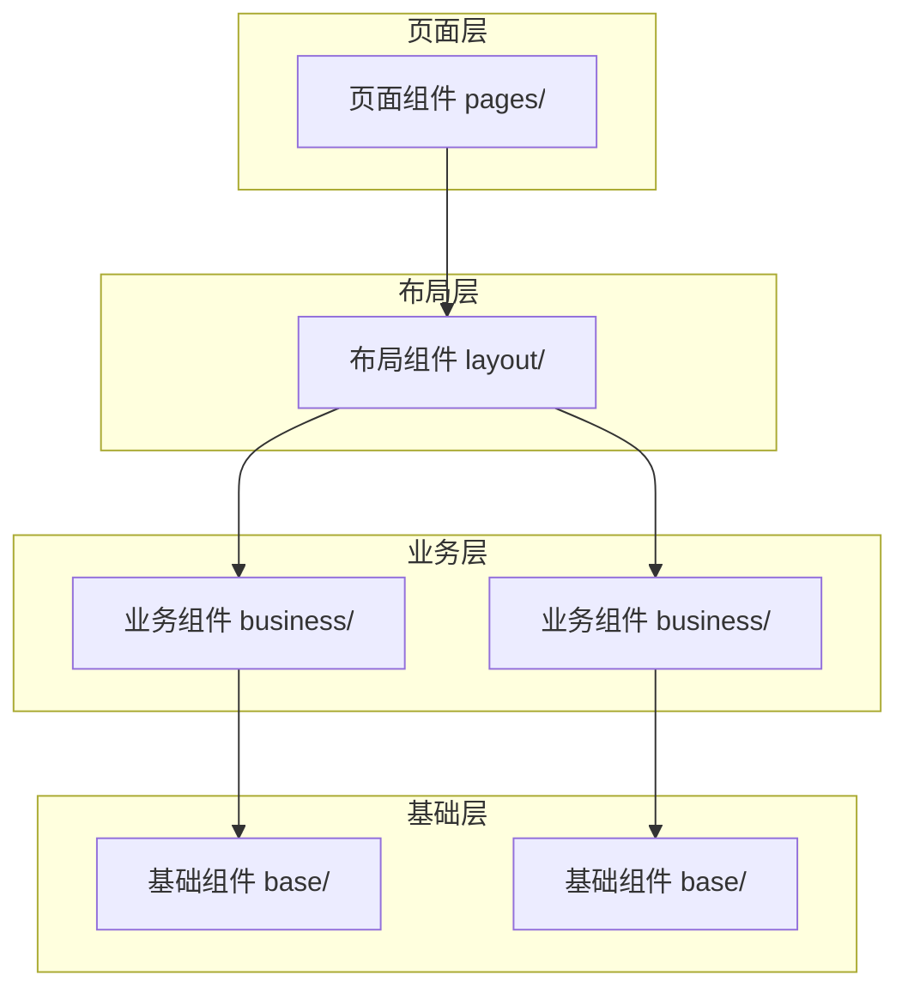

# 前端架构详解

> RiskMonitor-FrontEnd 前端模块的详细架构设计，涵盖目录结构、状态管理、组件层级、通信层与路由设计。

## 目录结构设计

```
src/
├── components/              # 组件库
│   ├── base/                # 基础组件（Button、Input、Card 等）
│   │   ├── button/
│   │   │   ├── button.tsx
│   │   │   └── button.module.css
│   │   └── ...
│   ├── layout/              # 布局组件（Header、Sidebar、Panel 等）
│   └── business/            # 业务组件（AgentNode、TaskCard、MessageItem 等）
│       ├── agent-node/
│       ├── canvas/
│       ├── chat-panel/
│       └── task-list/
├── pages/                   # 页面组件
│   ├── home/                # 首页
│   ├── workspace/           # 工作区（专家团画布 + 对话面板）
│   └── settings/            # 设置页
├── hooks/                   # 自定义 Hooks
│   ├── use-sse.ts           # SSE 连接管理
│   ├── use-agent-status.ts  # 智能体状态订阅
│   └── use-task-flow.ts     # 任务流管理
├── store/                   # Zustand 状态管理
│   ├── chat-store.ts        # 对话领域 Store
│   ├── task-store.ts        # 任务领域 Store
│   ├── canvas-store.ts      # 画布领域 Store
│   └── agent-store.ts       # 智能体领域 Store
├── api/                     # 通信层
│   ├── sse-client.ts        # SSE 客户端封装
│   ├── http-client.ts       # HTTP 请求封装
│   └── endpoints.ts         # API 端点定义
├── machines/                # XState 状态机
│   ├── agent-machine.ts     # 智能体工作流状态机
│   └── task-machine.ts      # 任务状态机
├── utils/                   # 工具函数
│   ├── format.ts            # 格式化工具
│   ├── validation.ts        # 验证工具
│   └── constants.ts         # 常量定义
├── types/                   # 类型定义
│   ├── agent.ts             # 智能体类型
│   ├── task.ts              # 任务类型
│   ├── message.ts           # 消息类型
│   └── index.ts             # 类型导出汇总
├── assets/                  # 静态资源
│   ├── images/
│   └── icons/
├── styles/                  # 全局样式
│   ├── global.css           # 全局样式
│   └── variables.css        # CSS 变量
└── main.tsx                 # 应用入口
```

## 状态管理架构

### Zustand Store 设计

按领域拆分 Store，每个 Store 只管理自己领域内的状态，Store 之间通过事件或中间件通信。

```typescript
// store/chat-store.ts
import { create } from 'zustand'

interface ChatState {
  messages: Message[]
  streamingMessage: Message | null
  isStreaming: boolean

  addMessage: (message: Message) => void
  appendToken: (messageId: string, token: string) => void
  clearMessages: () => void
}

export const useChatStore = create<ChatState>((set) => ({
  messages: [],
  streamingMessage: null,
  isStreaming: false,

  addMessage: (message) =>
    set((state) => ({ messages: [...state.messages, message] })),

  appendToken: (messageId, token) =>
    set((state) => ({
      messages: state.messages.map((m) =>
        m.id === messageId ? { ...m, content: m.content + token } : m
      ),
    })),

  clearMessages: () => set({ messages: [], streamingMessage: null }),
}))
```

### Store 领域划分

| Store | 职责 | 核心状态 |
|-------|------|----------|
| `chat-store` | 对话消息管理 | messages、streamingMessage、isStreaming |
| `task-store` | 任务状态管理 | tasks、activeTaskId、taskDependencies |
| `canvas-store` | 画布节点管理 | nodes、edges、selectedNodeId |
| `agent-store` | 智能体管理 | agents、activeAgents、agentStatus |

### XState 状态机建模

专家工作流使用 XState 建模，确保状态转换的合法性和可追溯性：

```typescript
// machines/agent-machine.ts
import { createMachine } from 'xstate'

export const agentMachine = createMachine({
  id: 'agent',
  initial: 'idle',
  states: {
    idle: {
      on: { ASSIGN: 'assigned' },
    },
    assigned: {
      on: { START: 'working' },
    },
    working: {
      on: {
        COMPLETE: 'completed',
        ERROR: 'failed',
        CANCEL: 'cancelled',
      },
    },
    completed: { type: 'final' },
    failed: {
      on: { RETRY: 'assigned' },
    },
    cancelled: { type: 'final' },
  },
})
```

## 组件层级设计



### 层级规则

| 层级 | 路径 | 职责 | 可访问 |
|------|------|------|--------|
| 页面组件 | `pages/` | 路由页面、组合布局与业务组件 | Store、Hooks、API |
| 布局组件 | `components/layout/` | 页面结构组织、响应式布局 | Store（只读）、Hooks |
| 业务组件 | `components/business/` | 特定业务逻辑、领域组件 | Store、Hooks、API |
| 基础组件 | `components/base/` | 通用 UI 元素，无业务逻辑 | 仅 Props 传入 |

## 通信层设计

### SSE 客户端

```typescript
// api/sse-client.ts
export class SSEClient {
  private eventSource: EventSource | null = null
  private reconnectAttempts = 0
  private readonly maxReconnect = 5

  connect(url: string, handlers: SSEHandlers): void {
    this.eventSource = new EventSource(url)

    this.eventSource.onmessage = (event) => {
      const data = JSON.parse(event.data) as SSEMessage
      this.dispatch(data, handlers)
    }

    this.eventSource.onerror = () => this.reconnect(url, handlers)
  }

  disconnect(): void {
    this.eventSource?.close()
    this.eventSource = null
  }

  private dispatch(message: SSEMessage, handlers: SSEHandlers): void {
    switch (message.type) {
      case 'agent_status':
        handlers.onAgentStatus?.(message)
        break
      case 'token_stream':
        handlers.onTokenStream?.(message)
        break
      case 'task_update':
        handlers.onTaskUpdate?.(message)
        break
      case 'artifact':
        handlers.onArtifact?.(message)
        break
      case 'error':
        handlers.onError?.(message)
        break
    }
  }

  // ... 断线重连逻辑
}
```

### HTTP 请求封装

```typescript
// api/http-client.ts
export class HTTPClient {
  private baseURL: string

  constructor(baseURL: string) {
    this.baseURL = baseURL
  }

  async request<T>(path: string, options?: RequestInit): Promise<T> {
    const response = await fetch(`${this.baseURL}${path}`, {
      headers: { 'Content-Type': 'application/json', ...options?.headers },
      ...options,
    })

    if (!response.ok) {
      throw new HTTPError(response.status, await response.text())
    }

    return response.json() as Promise<T>
  }
}
```

## 路由设计

采用 React Router v7 进行客户端路由管理：

```typescript
// 首版页面骨架
const routes = [
  {
    path: '/',
    element: <HomePage />,
  },
  {
    path: '/workspace',
    element: <WorkspacePage />,
  },
  {
    path: '/settings',
    element: <SettingsPage />,
  },
]
```

### 路由规划

| 路径 | 页面 | 说明 |
|------|------|------|
| `/` | 首页 | 项目入口、任务概览、能力展示 |
| `/workspace` | 工作区 | Figma 风格三栏布局，包含任务列表、协作画布、详情面板和底部事件流 |
| `/settings` | 设置页 | SSE、角色与主题等运行配置骨架 |

### 首版页面骨架

当前代码骨架已落地以下页面与核心组件：

```text
pages/
├── home-page.tsx              # 首页
├── workspace-page.tsx         # 工作台
└── settings-page.tsx          # 设置页

components/
├── layout/
│   └── app-shell.tsx          # 全局头部与导航壳层
├── base/
│   ├── surface-card.tsx       # 通用卡片
│   ├── status-badge.tsx       # 状态徽标
│   └── progress-bar.tsx       # 进度条
└── business/
    ├── task-list-panel.tsx    # 左侧任务与 KPI 面板
    ├── workspace-canvas.tsx   # 中间多智能体画布
    ├── detail-panel.tsx       # 右侧角色详情
    └── event-timeline.tsx     # 底部事件流
```

数据模型定义详见 [数据模型](data-model.md)，架构总体设计详见 [架构概览](overview.md)。
