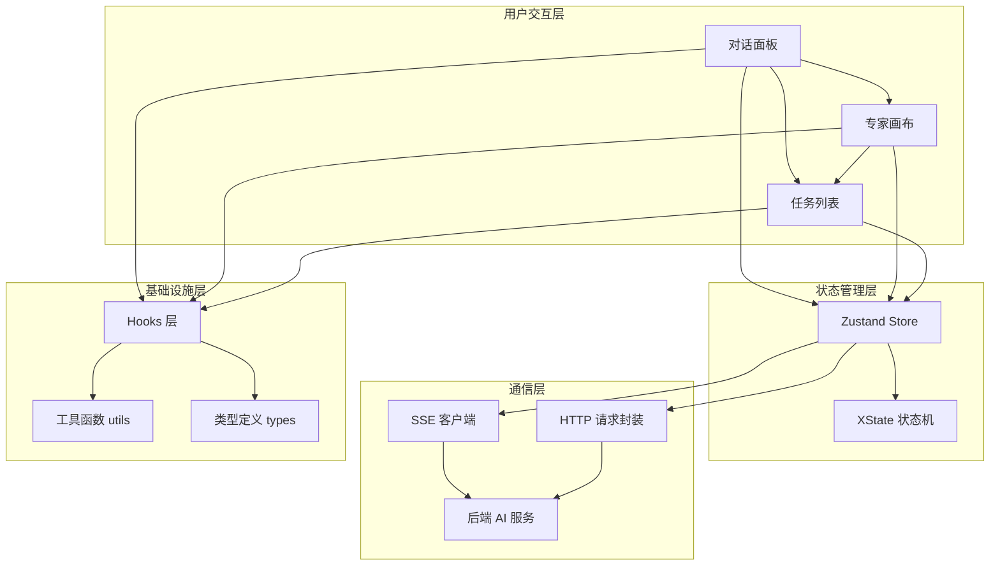
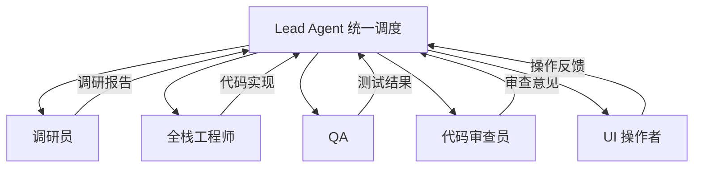

# 架构概览

> RiskAgent-FrontEnd 系统总体架构设计文档。本文从全局视角描述前端各模块的关系与设计理念。

## 系统总体架构

### 模块职责

| 模块 | 职责 | 关键技术 |
|------|------|----------|
| 对话面板 | 用户输入、流式消息展示、多智能体对话聚合 | React + SSE |
| 专家画布 | 智能体节点可视化、依赖关系连线、状态实时更新 | React Flow |
| 任务列表 | 任务分解展示、状态追踪、依赖管理 | React + Zustand |
| Zustand Store | 全局状态管理、按领域拆分、跨组件通信 | Zustand |
| XState 状态机 | 专家工作流状态建模、任务状态转换 | XState |
| SSE 客户端 | 实时事件流接收、断线重连、消息分发 | EventSource |
| HTTP 请求封装 | 非流式 API 请求、错误处理、请求拦截 | Fetch API |

## 架构设计原则

### 1. 模块化

每个模块拥有清晰的边界和单一职责。模块间通过明确定义的接口通信，避免隐式依赖。组件按 `base` → `layout` → `business` → `pages` 分层，下层不依赖上层。

### 2. 可扩展

系统设计预留扩展点，支持新增智能体角色、消息类型和画布节点类型，无需修改核心架构。Store 按领域拆分，新增功能域不影响现有域。

### 3. 上下文隔离

每个智能体拥有独立的状态空间和上下文。前端通过 Store 领域隔离确保不同智能体的数据不交叉污染，对话面板通过标签或区域区分不同来源的消息。

### 4. 实时响应

所有状态变更通过 SSE 实时推送，前端使用 Zustand 的订阅机制确保 UI 即时更新。流式对话采用逐 token 渲染，保证用户感知的低延迟。

## 核心概念

### BackEnd 专家团

专家团是本项目的核心协作模型，由 Lead Agent 统一调度多个专家角色完成复杂任务：

### 任务编排

Lead Agent 将用户请求分解为子任务，按依赖关系编排执行顺序。每个子任务分配给特定专家角色，任务间通过产物流水线传递上下文。

### 依赖管理

任务之间可能存在依赖关系（如代码审查依赖代码实现完成）。前端通过 DAG（有向无环图）管理任务依赖，在画布上以连线可视化呈现。

### 产物流水线

智能体的产出物（Artifact）按类型分类管理，包括代码文件、调研报告、测试报告、审查意见等。产出物支持版本追踪，可追溯生成路径。

## 技术选型决策摘要

关键技术选型的详细决策记录见 ADR 文档：

| 决策 | ADR | 状态 |
|------|-----|------|
| React 19 + Vite 8 + TypeScript 6 技术栈 | [0001-tech-stack-selection](../decisions/0001-tech-stack-selection.md) | Accepted |
| Zustand + React Flow + SSE + XState 架构 | [0002-backend-frontend-architecture](../decisions/0002-backend-frontend-architecture.md) | Accepted |

前端模块的详细设计见 [前端架构详解](frontend.md)，核心数据类型定义见 [数据模型](data-model.md)。
