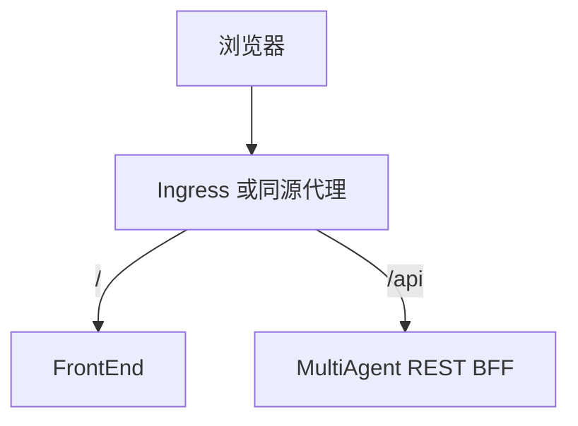

# REST BFF 接口契约

> RiskMonitor-FrontEnd 与 RiskMonitor-MultiAgent 在 MVP 阶段使用的浏览器友好型接口契约. 本文档约束最小 demo 闭环的请求, 响应和状态映射.

## 目标

- 为 FrontEnd 提供稳定的浏览器接口
- 隔离 MultiAgent 内部 MCP 协议和工作流复杂度
- 支持 `提交任务 -> 轮询状态 -> 展示结果` 的最小闭环

## 协议原则

- 协议风格采用 REST + JSON
- MVP 阶段只使用轮询, 不要求 SSE
- 所有业务接口统一挂在 `/api/*`
- 时间字段统一使用 Unix 毫秒时间戳
- 未落地的字段不在接口中承诺

## 部署关系



## 1. 创建任务

### 请求

- 方法: `POST`
- 路径: `/api/tasks`
- `Content-Type`: `application/json`

```json
{
  "description": "查询所有 desk 头寸"
}
```

### 请求约束

- `description` 必填
- `description` 为用户自然语言任务描述
- MVP 阶段不要求额外 metadata

### 成功响应

```json
{
  "task_id": "run_123456",
  "status": "pending",
  "created_at": 1784803200000
}
```

### 失败响应

```json
{
  "error": {
    "code": "INVALID_ARGUMENT",
    "message": "description is required"
  }
}
```

## 2. 查询任务详情

### 请求

- 方法: `GET`
- 路径: `/api/tasks/{task_id}`

### 成功响应

```json
{
  "id": "run_123456",
  "title": "查询所有 desk 头寸",
  "description": "查询所有 desk 头寸",
  "status": "running",
  "steps": [
    {
      "id": "intent",
      "title": "意图识别",
      "status": "completed"
    },
    {
      "id": "plan",
      "title": "任务规划",
      "status": "running"
    }
  ],
  "result": null,
  "error": null,
  "created_at": 1784803200000,
  "updated_at": 1784803205000
}
```

### 字段说明

| 字段 | 类型 | 说明 |
|------|------|------|
| `id` | string | 前端任务 ID |
| `title` | string | 展示标题, 可与 description 相同 |
| `description` | string | 原始任务描述 |
| `status` | string | 任务聚合状态 |
| `steps` | array | 可展示的阶段列表 |
| `result` | object \| null | 最终结果 |
| `error` | object \| null | 失败时的错误信息 |
| `created_at` | number | 创建时间 |
| `updated_at` | number | 最近更新时间 |

### `result` 建议结构

```json
{
  "summary": "当前 desk 头寸整体处于安全区间",
  "artifacts": [
    {
      "id": "artifact_1",
      "type": "report",
      "title": "风控分析结论",
      "content": "..."
    }
  ]
}
```

### `error` 建议结构

```json
{
  "code": "WORKFLOW_FAILED",
  "message": "llm request failed"
}
```

## 3. 查询智能体状态

### 请求

- 方法: `GET`
- 路径: `/api/agents`

### 成功响应

```json
{
  "items": [
    {
      "id": "orchestrator",
      "role": "lead",
      "name": "OrchestratorAgent",
      "status": "working",
      "currentTaskId": "run_123456",
      "capabilities": ["plan", "delegate"],
      "lastActiveAt": 1784803205000
    }
  ],
  "updated_at": 1784803205000
}
```

## 4. 健康检查

### 请求

- 方法: `GET`
- 路径: `/health`

### 成功响应

```json
{
  "status": "ok"
}
```

## 状态映射

### 后端任务状态到前端任务状态

| 后端聚合状态 | 前端 `TaskStatus` |
|--------------|-------------------|
| `pending` | `pending` |
| `running` | `in_progress` |
| `completed` | `completed` |
| `failed` | `failed` |
| `cancelled` | `cancelled` |

### 后端智能体状态到前端智能体状态

| 后端状态 | 前端 `AgentStatus` |
|----------|--------------------|
| `idle` | `idle` |
| `assigned` | `assigned` |
| `working` | `working` |
| `completed` | `completed` |
| `failed` | `failed` |
| `cancelled` | `cancelled` |

## 错误模型

所有失败响应统一采用下列结构:

```json
{
  "error": {
    "code": "ERROR_CODE",
    "message": "human readable message"
  }
}
```

推荐状态码:

| 场景 | HTTP 状态码 | `error.code` |
|------|-------------|--------------|
| 参数错误 | `400` | `INVALID_ARGUMENT` |
| 未认证 | `401` | `UNAUTHORIZED` |
| 任务不存在 | `404` | `TASK_NOT_FOUND` |
| 服务未就绪 | `503` | `SERVICE_NOT_READY` |
| 内部异常 | `500` | `INTERNAL_ERROR` |

## 轮询建议

- 前端提交任务后立即启动轮询
- 轮询间隔建议为 2 秒
- 当任务进入 `completed` `failed` `cancelled` 时停止轮询
- 连续失败 3 次后给出错误提示, 由用户决定是否重试

## 鉴权约束

- MVP 阶段默认可以在同源内网环境下无认证访问
- 如果后端启用 Bearer Token, 由 `http-client.ts` 统一注入请求头
- 不允许在组件中直接处理鉴权逻辑

## 文档边界

- 本文档只约束浏览器调用协议
- MultiAgent 内部 MCP, workflow, trace, memory 结构不在本文档承诺范围内
- SSE 协议如后续落地, 需要新增独立契约文档

## 相关文档

- [前端架构](frontend.md)
- [数据模型](data-model.md)
- [PRD](../PRD.md)
- [Phase 0](../phases/phase-0-dual-app-foundation.md)
