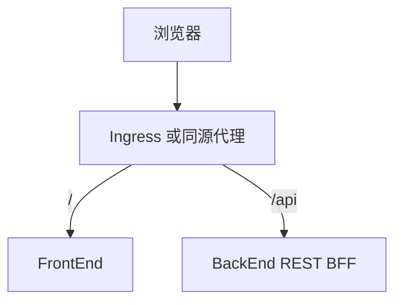

# REST BFF 接口契约

> RiskAgent-FrontEnd 与 RiskAgent-BackEnd 在 MVP 阶段使用的浏览器友好型接口契约. 本文档约束最小 demo 闭环的请求, 响应和状态映射.

## 目标

- 为 FrontEnd 提供稳定的浏览器接口
- 隔离 BackEnd 内部 MCP 协议和工作流复杂度
- 支持 `提交任务 -> 轮询状态 -> 展示结果` 的最小闭环
- 支持浏览器观察结构化 memory 视图而不直接访问 Redis
- 支持浏览器观察真实执行的 TaskGraph DAG 与实时状态变化

## 协议原则

- 协议风格采用 REST + JSON + SSE
- 智能体状态和记忆默认通过 SSE 实时推送, 轮询只用于降级兜底
- 所有业务接口统一挂在 `/api/*`
- 时间字段统一使用 Unix 毫秒时间戳
- 未落地的字段不在接口中承诺
- memory 数据必须经过后端脱敏和结构化整理
- TaskGraph 节点和边必须经过浏览器友好映射, 不直接暴露内部复杂对象引用

## 部署关系



## 1. 创建任务

### 请求

- 方法: `POST`
- 路径: `/api/tasks`
- `Content-Type`: `application/json`

```json
{
  "description": "查询所有 desk 头寸"
}
```

### 请求约束

- `description` 必填
- `description` 为用户自然语言任务描述
- MVP 阶段不要求额外 metadata

### 成功响应

```json
{
  "task_id": "run_123456",
  "status": "pending",
  "created_at": 1784803200000
}
```

### 失败响应

```json
{
  "error": {
    "code": "INVALID_ARGUMENT",
    "message": "description is required"
  }
}
```

## 2. 查询任务详情

### 请求

- 方法: `GET`
- 路径: `/api/tasks/{task_id}`

### 成功响应

```json
{
  "id": "run_123456",
  "title": "查询所有 desk 头寸",
  "description": "查询所有 desk 头寸",
  "status": "running",
  "steps": [
    {
      "id": "intent",
      "title": "意图识别",
      "status": "completed"
    },
    {
      "id": "plan",
      "title": "任务规划",
      "status": "running"
    }
  ],
  "result": null,
  "error": null,
  "created_at": 1784803200000,
  "updated_at": 1784803205000
}
```

### 字段说明

| 字段 | 类型 | 说明 |
|------|------|------|
| `id` | string | 前端任务 ID |
| `title` | string | 展示标题, 可与 description 相同 |
| `description` | string | 原始任务描述 |
| `status` | string | 任务聚合状态 |
| `steps` | array | 可展示的阶段列表 |
| `result` | object \| null | 最终结果 |
| `error` | object \| null | 失败时的错误信息 |
| `created_at` | number | 创建时间 |
| `updated_at` | number | 最近更新时间 |

### `result` 建议结构

```json
{
  "summary": "当前 desk 头寸整体处于安全区间",
  "artifacts": [
    {
      "id": "artifact_1",
      "type": "report",
      "title": "风控分析结论",
      "content": "..."
    }
  ]
}
```

### `error` 建议结构

```json
{
  "code": "WORKFLOW_FAILED",
  "message": "llm request failed"
}
```

## 2.1 查询任务图快照

### 请求

- 方法: `GET`
- 路径: `/api/tasks/{task_id}/graph`

### 成功响应

```json
{
  "task_id": "run_123456",
  "session_id": "session_123456",
  "status": "running",
  "schema_version": "task_graph.v1",
  "nodes": [
    {
      "id": "step_1",
      "label": "delegate system_engineer",
      "kind": "delegate",
      "status": "completed",
      "targetAgent": "system_engineer",
      "reason": "先拉取风险暴露明细",
      "startedAt": 1784803201000,
      "finishedAt": 1784803203000,
      "durationMs": 2000,
      "data": {
        "step_id": "step_1",
        "kind": "delegate",
        "target_agent": "system_engineer"
      }
    }
  ],
  "edges": [
    {
      "id": "step_1__step_2",
      "source": "step_1",
      "target": "step_2",
      "status": "running",
      "condition": "always",
      "data": {
        "from_step_id": "step_1",
        "to_step_id": "step_2",
        "condition": "always"
      }
    }
  ],
  "summary": {
    "nodeCount": 2,
    "edgeCount": 1,
    "completedCount": 1,
    "runningCount": 1,
    "failedCount": 0,
    "blockedCount": 0
  },
  "updated_at": 1784803205000
}
```

### 字段说明

| 字段 | 类型 | 说明 |
|------|------|------|
| `task_id` | string | 任务 ID |
| `status` | string | 任务聚合状态 |
| `schema_version` | string | TaskGraph 契约版本 |
| `nodes` | array | 浏览器友好的节点列表 |
| `edges` | array | 浏览器友好的边列表 |
| `summary` | object | 图级统计信息 |
| `updated_at` | number | 最近更新时间 |

## 3. 查询智能体状态

### 请求

- 方法: `GET`
- 路径: `/api/agents`

### 成功响应

```json
{
  "items": [
    {
      "id": "orchestrator",
      "role": "lead",
      "name": "OrchestratorAgent",
      "status": "working",
      "currentTaskId": "run_123456",
      "capabilities": ["plan", "delegate"],
      "lastActiveAt": 1784803205000
    }
  ],
  "updated_at": 1784803205000
}
```

## 4. 健康检查

### 请求

- 方法: `GET`
- 路径: `/health`

### 成功响应

```json
{
  "status": "ok"
}
```

## 5. 查询全局记忆快照

### 请求

- 方法: `GET`
- 路径: `/api/memory`

### 查询参数

- `limit`: 可选, 默认 `20`

### 成功响应

```json
{
  "items": [
    {
      "id": "mem_xxx",
      "taskId": "run_123456",
      "sessionId": "session_123456",
      "agentId": "system_engineer",
      "scope": "shared",
      "kind": "working_memory",
      "memoryType": "episodic",
      "changeType": "updated",
      "summary": "step step_2 kind=delegate status=completed agent=system_engineer",
      "details": [
        "任务 run_123456",
        "来源 task_graph_execution"
      ],
      "tags": ["delegate", "completed", "execution"],
      "confidence": 1,
      "createdAt": 1784803205000
    }
  ],
  "updated_at": 1784803205000
}
```

## 6. 查询任务记忆视图

### 请求

- 方法: `GET`
- 路径: `/api/tasks/{task_id}/memory`

### 查询参数

- `limit`: 可选, 默认 `30`

### 成功响应

```json
{
  "task_id": "run_123456",
  "session_id": "session_123456",
  "items": [
    {
      "id": "mem_xxx",
      "taskId": "run_123456",
      "sessionId": "session_123456",
      "agentId": "orchestrator",
      "scope": "shared",
      "kind": "plan",
      "memoryType": "episodic",
      "changeType": "created",
      "summary": "plan generated",
      "details": [
        "来源 orchestrator_plan",
        "标签 plan"
      ],
      "tags": ["plan"],
      "confidence": 1,
      "createdAt": 1784803201000
    }
  ],
  "summary": {
    "sharedCount": 8,
    "privateCount": 3,
    "agentCount": 4
  },
  "updated_at": 1784803205000
}
```

## 7. 实时事件流

### 请求

- 方法: `GET`
- 路径: `/api/stream`
- 协议: `text/event-stream`

### 查询参数

- `task_id`: 可选. 传入后优先推送该任务相关的记忆视图
- `agents`: 可选. 默认 `1`
- `memory`: 可选. 默认 `1`
- `graph`: 可选. 默认 `1`

### 事件类型

#### `agent_snapshot`

```json
{
  "type": "agent_snapshot",
  "updated_at": 1784803205000,
  "data": {
    "items": [
      {
        "id": "orchestrator",
        "role": "lead",
        "name": "ProactiveOrchestratorAgent",
        "status": "working",
        "currentTaskId": "run_123456",
        "capabilities": ["plan", "coordinate", "monitor"],
        "lastActiveAt": 1784803205000
      }
    ],
    "updated_at": 1784803205000
  }
}
```

#### `memory_snapshot`

```json
{
  "type": "memory_snapshot",
  "updated_at": 1784803205000,
  "data": {
    "task_id": "run_123456",
    "session_id": "session_123456",
    "items": [],
    "summary": {
      "sharedCount": 8,
      "privateCount": 3,
      "agentCount": 4
    },
    "updated_at": 1784803205000
  }
}
```

#### `graph_snapshot`

```json
{
  "type": "graph_snapshot",
  "updated_at": 1784803205000,
  "data": {
    "task_id": "run_123456",
    "status": "running",
    "schema_version": "task_graph.v1",
    "nodes": [],
    "edges": [],
    "updated_at": 1784803205000
  }
}
```

#### `heartbeat`

```json
{
  "type": "heartbeat",
  "ts": 1784803205000
}
```

### memory 字段说明

| 字段 | 类型 | 说明 |
|------|------|------|
| `id` | string | memory 条目标识 |
| `taskId` | string \| null | 所属任务 |
| `sessionId` | string \| null | 所属会话 |
| `agentId` | string | 来源智能体 |
| `scope` | string | `shared` 或 `private` |
| `kind` | string | 原始记忆种类 |
| `memoryType` | string | `episodic` `semantic` `procedural` |
| `changeType` | string | `created` `updated` `compressed` `archived` |
| `summary` | string | 面向页面展示的结构化摘要 |
| `details` | array | 补充说明列表 |
| `tags` | array | 记忆标签 |
| `confidence` | number | 置信度 |
| `createdAt` | number | 生成时间 |

## 状态映射

### 后端任务状态到前端任务状态

| 后端聚合状态 | 前端 `TaskStatus` |
|--------------|-------------------|
| `pending` | `pending` |
| `running` | `in_progress` |
| `completed` | `completed` |
| `failed` | `failed` |
| `cancelled` | `cancelled` |

### memory 变化类型

| 后端记忆类型 | 前端 `changeType` |
|--------------|-------------------|
| `plan` `intent_disambiguation` `approval` `final` | `created` |
| `working_memory` `private_task_state` | `updated` |
| `lesson` `semantic_case` | `compressed` |
| 其他 | `created` |

### TaskGraph 状态映射

| 后端图状态 | 前端图状态 |
|------------|------------|
| `pending` | `pending` |
| `ready` | `ready` |
| `running` | `running` |
| `completed` | `completed` |
| `failed` | `failed` |
| `blocked` | `blocked` |
| `skipped` | `skipped` |

### 后端智能体状态到前端智能体状态

| 后端状态 | 前端 `AgentStatus` |
|----------|--------------------|
| `idle` | `idle` |
| `assigned` | `assigned` |
| `working` | `working` |
| `completed` | `completed` |
| `failed` | `failed` |
| `cancelled` | `cancelled` |

## 错误模型

所有失败响应统一采用下列结构:

```json
{
  "error": {
    "code": "ERROR_CODE",
    "message": "human readable message"
  }
}
```

推荐状态码:

| 场景 | HTTP 状态码 | `error.code` |
|------|-------------|--------------|
| 参数错误 | `400` | `INVALID_ARGUMENT` |
| 未认证 | `401` | `UNAUTHORIZED` |
| 任务不存在 | `404` | `TASK_NOT_FOUND` |
| 服务未就绪 | `503` | `SERVICE_NOT_READY` |
| 内部异常 | `500` | `INTERNAL_ERROR` |

## 实时与降级建议

- 前端默认建立 `/api/stream` 长连接订阅智能体状态, 记忆变化和 TaskGraph 变化
- SSE 断开后前端应自动重连
- 当浏览器或网络环境不支持 SSE 时, 前端可退化为原有轮询逻辑
- 降级轮询间隔建议为 2 秒
- 当没有 active task 时, 页面订阅全局 memory 快照
- 当有 active task 时, 页面优先订阅任务维度的 memory 快照和 graph 快照

## 鉴权约束

- MVP 阶段默认可以在同源内网环境下无认证访问
- 如果后端启用 Bearer Token, 由 `http-client.ts` 统一注入请求头
- 不允许在组件中直接处理鉴权逻辑

## 文档边界

- 本文档只约束浏览器调用协议
- BackEnd 内部 MCP, workflow, trace, memory 结构不在本文档承诺范围内
- 前端任务详情轮询与表单提交仍保留在本文档约束范围内

## 相关文档

- [前端架构](frontend.md)
- [数据模型](data-model.md)
- [PRD](../PRD.md)
- [Phase 0](../phases/phase-0-dual-app-foundation.md)
