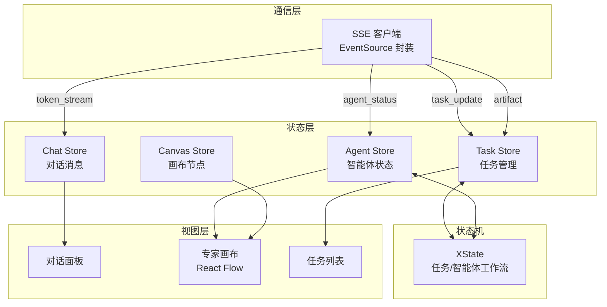

# ADR-0002: MultiAgent 前端架构

| 字段 | 值 |
|------|-----|
| 编号 | 0002 |
| 标题 | MultiAgent 前端架构设计决策 |
| 状态 | Accepted |
| 日期 | 2026-07-03 |
| 决策者 | 项目团队 |

## 上下文

本项目需要在前端实现类似 Qoder 专家团的多智能体协作功能。核心挑战包括：

1. **多角色状态管理** — 6 个专家角色（Lead、Researcher、Engineer、QA、Reviewer、UI Operator）各自拥有独立状态，又需协同工作
2. **实时通信** — 智能体的状态变更、流式对话输出、任务进度需通过 SSE 实时推送
3. **可视化编排** — 智能体之间的依赖关系和任务流转需要以画布形式可视化呈现
4. **状态转换可靠性** — 任务状态流转（pending → in_progress → completed/failed/cancelled）需保证合法性和可追溯性
5. **上下文隔离** — 每个智能体的对话和产出物需隔离，避免信息污染

## 决策

采用以下架构组合：

| 架构层 | 技术方案 | 解决的问题 |
|--------|----------|------------|
| 全局状态管理 | Zustand（按领域拆分 Store） | 多角色状态管理、跨组件通信 |
| 专家画布 | React Flow | 智能体可视化、依赖关系连线 |
| 实时通信 | 原生 SSE（EventSource） | 流式对话、状态推送 |
| 工作流建模 | XState 状态机 | 任务状态转换合法性 |

## 理由

### Zustand 管理全局任务状态

- **按领域拆分**：将状态分为 chat、task、canvas、agent 四个领域，每个 Store 独立管理
- **细粒度订阅**：通过选择器只订阅需要的字段，避免不必要的重渲染
- **跨 Store 通信**：通过 `getState()` 方式在必要时跨领域通知，保持松耦合
- **轻量无 Provider**：不需要在组件树顶层包裹 Provider，减少嵌套和性能开销
- 对比 Redux：更简洁的 API，更少的样板代码；对比 Context：更精准的重渲染控制

### React Flow 构建专家画布

- **专业画布能力**：内置拖拽、缩放、连线、最小化等交互
- **自定义节点**：每个智能体可渲染为包含角色图标、状态指示、任务计数的自定义节点
- **自定义边**：任务依赖关系可渲染为带标签的连线
- **性能优化**：内置虚拟化渲染，支持大量节点
- 对比 D3：React Flow 是 React 原生组件，与 React 生态更融合；对比自定义 Canvas：开发成本低 10 倍以上

### SSE 实现实时通信

- **单向推送**：SSE 天然适合服务端到客户端的实时推送场景
- **自动重连**：浏览器原生支持断线重连
- **文本协议**：适合流式 token 传输
- **简单轻量**：无需引入 WebSocket 库
- 对比 WebSocket：SSE 更简单，不需要双向通信；对比轮询：实时性更好，资源消耗更低

### XState 建模专家工作流状态机

- **状态合法性**：状态机确保任务只能按合法路径转换（如不能从 completed 直接回到 in_progress）
- **可视化调试**：XState 提供状态图可视化，便于理解和调试
- **事件驱动**：清晰定义触发状态转换的事件
- **可追溯性**：状态机自动记录状态转换历史
- 对比手动状态管理：避免状态转换逻辑散落在各处，集中管理更可靠

## 后果

### 优势

- **清晰的领域边界**：Zustand 按领域拆分使各模块职责清晰，新增角色或功能不影响现有模块
- **实时性保障**：SSE + Zustand 订阅机制实现从服务端推送到 UI 更新的低延迟链路
- **可视化编排**：React Flow 提供专业级画布体验，用户直观理解智能体协作关系
- **状态可靠性**：XState 确保任务状态转换不会出现非法状态，减少 Bug
- **可扩展性**：新增智能体角色只需新增 Store 领域和画布节点类型，架构无需改动

### 风险

- **SSE 连接管理**：断线重连、消息丢失、事件顺序等需要自行处理
- **Store 数量增长**：随着功能增加，Store 数量可能膨胀，跨 Store 通信复杂度上升
- **XState 学习成本**：团队需要学习状态机概念和 XState API
- **React Flow 定制深度**：深度定制节点和交互可能触及 React Flow 内部 API
- **SSE 并发限制**：浏览器对同源 SSE 连接数有限制（HTTP/1.1 下 6 个）

### 缓解措施

- SSE 连接管理封装在 `src/api/sse-client.ts`，实现序列号校验和消息重放机制
- Store 跨领域通信通过明确的接口方法，禁止直接修改其他 Store 的内部状态
- XState 仅用于任务和智能体工作流状态建模，不强制在所有场景使用
- React Flow 定制封装在 `components/business/canvas/` 目录，隔离内部 API 依赖
- 使用 HTTP/2 或多路复用避免 SSE 连接数限制

## 架构示意

## 相关 ADR

- [ADR-0001: 技术栈选型](0001-tech-stack-selection.md) — 本架构决策基于的技术栈选型
