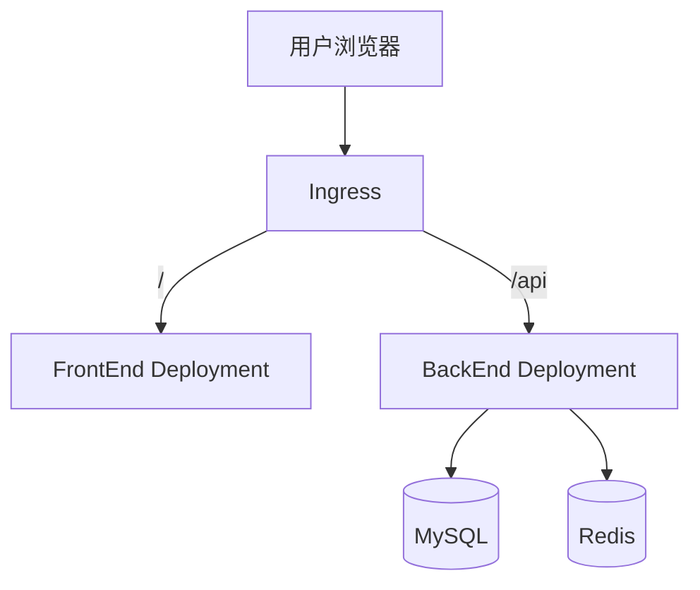

# ADR-0004: 双应用仓库与 K8s 部署决策

| 字段 | 值 |
|------|-----|
| 编号 | 0004 |
| 标题 | 双应用仓库与 K8s 部署决策 |
| 状态 | Accepted |
| 日期 | 2026-07-23 |
| 决策者 | 项目团队 |

## 上下文

当前仓库包含两个独立应用:

- `RiskAgent-FrontEnd` — React + Vite + TypeScript 前端
- `RiskAgent-BackEnd` — Python + FastMCP 多智能体后端

当前面临的核心选择是:

1. 是否把前后端合并成一个代码项目
2. 如果不合并, 是否应该拆成两个独立仓库
3. 为了云端 K8s 最小 demo 闭环, 运行时应该如何部署

项目当前的现实约束如下:

- 前后端技术栈完全不同, 构建链和发布链不同
- 后端已经存在独立容器化和 Helm 基础
- 前端需要独立的页面演进空间和文档系统
- 当前目标是先跑通最小 demo 闭环, 再持续扩展

## 决策

采用 `单仓库双应用` 策略:

| 决策点 | 选择 | 理由 |
|--------|------|------|
| 仓库组织 | 单仓库 | 保持共享上下文, 联调和文档治理成本最低 |
| 应用边界 | 双应用 | 前后端保持独立构建, 独立测试, 独立部署 |
| 前后端通信 | REST BFF | 前端不直接实现 MCP 客户端, 降低耦合度 |
| 运行时部署 | K8s 双 Deployment + 单 Ingress | 前端和后端分开部署, 对外统一入口 |
| MVP 通信协议 | 轮询 | 先完成最小闭环, 后续再升级 SSE |

## 理由

### 保持双应用边界

- React 构建产物和 Python 服务的运行模型不同, 强行合并只会增加构建和发布复杂度
- 前端需要独立页面演进, 后端需要独立工作流演进, 双应用更符合实际开发节奏
- K8s 中前端和后端天然就是不同类型的工作负载, 分开部署更自然

### 保持单仓库

- 当前阶段前后端联调频繁, 单仓库更容易统一管理文档, API 协议和交付节奏
- 对最小 demo 阶段而言, 两个独立仓库会额外引入版本协调和变更追踪成本

### 通过 REST BFF 解耦

- 后端当前核心是 MCP 服务, 不适合让浏览器直接接入
- 前端通过 `POST /api/tasks` `GET /api/tasks/{task_id}` `GET /api/agents` 即可完成最小闭环
- 这层 BFF 可以吸收后端内部工作流复杂度, 保持浏览器协议稳定

### 采用 K8s 双 Deployment

- 前端使用独立镜像承载静态文件和 Web 服务
- 后端使用独立镜像承载多智能体服务和依赖编排
- 通过单一 Ingress 把 `/` 路由到前端, `/api` 路由到后端

## 后果

### 优势

- 前后端职责边界清晰
- 部署模型与 K8s 运行时一致
- 前端可独立回滚和独立扩容
- 文档治理更容易收口
- 不会因为 demo 阶段的临时耦合破坏后续架构

### 风险

- 需要维护两个镜像和两套构建流程
- 需要补齐前端容器化和 K8s 清单
- 需要先建设 REST BFF 才能联调

### 缓解措施

- 以单仓库统一管理文档和接口协议
- 先只支持轮询 MVP, 缩小第一阶段范围
- 将 K8s 第一阶段目标收敛到前端页面与后端接口打通, 不把画布和 SSE 放入验收

## 部署示意

## 与既有 ADR 的关系

- `0003-volcengine-deployment` 记录的是早期单机 ECS MVP 路径
- 本决策面向当前 `云端 K8s 最小 demo 闭环` 目标
- 当两者冲突时, 当前实施阶段以本 ADR 为准

## 实施约束

- FrontEnd 不合并进 BackEnd 代码目录
- FrontEnd 不直接实现 MCP 协议
- MVP 阶段不要求 SSE, React Flow 和高可用

## 相关 ADR

- [ADR-0001: 技术栈选型](0001-tech-stack-selection.md)
- [ADR-0002: BackEnd 前端架构](0002-backend-frontend-architecture.md)
- [ADR-0003: 火山引擎部署决策](0003-volcengine-deployment.md)
