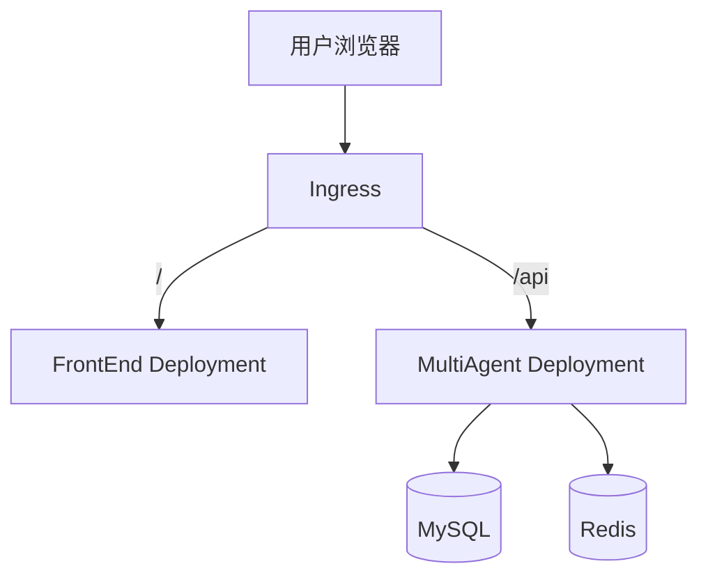

# 部署指南

> RiskMonitor-FrontEnd 当前采用双应用 K8s 部署路径. 前端和 MultiAgent 后端分别部署, 通过同一个 Ingress 对外暴露.

## 架构总览



## 部署原则

- FrontEnd 与 MultiAgent 保持独立镜像
- FrontEnd 与 MultiAgent 保持独立 Deployment 和 Service
- 外部访问统一通过 Ingress
- MVP 阶段使用 REST BFF + 轮询
- 本地先完成联调, 再推进云端 K8s

## 本地联调

### 后端启动

```bash
cd /Users/zhengchuan/Documents/TECH/Repo/RiskMonitor/RiskMonitor-MultiAgent
cp .env.example .env
docker compose up -d
curl http://localhost:8000/health
```

### 前端启动

```bash
cd /Users/zhengchuan/Documents/TECH/Repo/RiskMonitor/RiskMonitor-FrontEnd
npm install
npm run dev
```

### 本地联调约束

- 前端默认运行在 `http://localhost:5173`
- 后端默认运行在 `http://localhost:8000`
- 前端通过 Vite proxy 将 `/api/*` 转发到后端
- `VITE_API_BASE_URL` 开发环境保持为空

## 云端准备

### 集群与工具

- Kubernetes 集群已可访问
- 本地已安装 `kubectl`
- 本地已安装 Helm 3
- 已有可推送镜像的镜像仓库
- 已准备后端运行所需环境变量和 Secret

### 前端镜像要求

前端需要独立镜像, 推荐使用两阶段构建:

```dockerfile
FROM node:20-alpine AS build
WORKDIR /app
COPY package*.json ./
RUN npm ci
COPY . .
RUN npm run build

FROM nginx:1.27-alpine
COPY --from=build /app/dist /usr/share/nginx/html
COPY deploy/nginx/default.conf /etc/nginx/conf.d/default.conf
EXPOSE 80
```

### 前端 nginx 配置要求

```nginx
server {
  listen 80;
  server_name _;
  root /usr/share/nginx/html;
  index index.html;

  location / {
    try_files $uri $uri/ /index.html;
  }
}
```

## 镜像构建与推送

### 构建前端镜像

```bash
cd /Users/zhengchuan/Documents/TECH/Repo/RiskMonitor/RiskMonitor-FrontEnd
docker build -t <registry>/riskmonitor-frontend:<tag> .
docker push <registry>/riskmonitor-frontend:<tag>
```

### 构建后端镜像

```bash
cd /Users/zhengchuan/Documents/TECH/Repo/RiskMonitor/RiskMonitor-MultiAgent
docker build -t <registry>/riskmonitor-multiagent:<tag> -f Dockerfile .
docker push <registry>/riskmonitor-multiagent:<tag>
```

## 后端部署

后端继续复用 MultiAgent 已有 Helm Chart.

```bash
cd /Users/zhengchuan/Documents/TECH/Repo/RiskMonitor/RiskMonitor-MultiAgent
helm upgrade --install riskmonitor deploy/k8s/ \
  -f deploy/k8s/values-prod.yaml \
  --set image.repository=<registry>/riskmonitor-multiagent \
  --set image.tag=<tag> \
  -n riskmonitor --create-namespace
```

## 前端部署

### FrontEnd Deployment

```yaml
apiVersion: apps/v1
kind: Deployment
metadata:
  name: riskmonitor-frontend
  namespace: riskmonitor
spec:
  replicas: 1
  selector:
    matchLabels:
      app: riskmonitor-frontend
  template:
    metadata:
      labels:
        app: riskmonitor-frontend
    spec:
      containers:
        - name: frontend
          image: <registry>/riskmonitor-frontend:<tag>
          ports:
            - containerPort: 80
          resources:
            requests:
              cpu: 100m
              memory: 128Mi
            limits:
              cpu: 500m
              memory: 256Mi
```

### FrontEnd Service

```yaml
apiVersion: v1
kind: Service
metadata:
  name: riskmonitor-frontend
  namespace: riskmonitor
spec:
  selector:
    app: riskmonitor-frontend
  ports:
    - port: 80
      targetPort: 80
```

### Ingress

```yaml
apiVersion: networking.k8s.io/v1
kind: Ingress
metadata:
  name: riskmonitor
  namespace: riskmonitor
spec:
  ingressClassName: nginx
  rules:
    - host: <your-domain-or-ip>
      http:
        paths:
          - path: /
            pathType: Prefix
            backend:
              service:
                name: riskmonitor-frontend
                port:
                  number: 80
          - path: /api
            pathType: Prefix
            backend:
              service:
                name: mcp-server
                port:
                  number: 8000
          - path: /health
            pathType: Prefix
            backend:
              service:
                name: mcp-server
                port:
                  number: 8000
```

### 应用前端清单

```bash
kubectl apply -f deploy/k8s/frontend-deployment.yaml
kubectl apply -f deploy/k8s/frontend-service.yaml
kubectl apply -f deploy/k8s/ingress.yaml
```

## 验证步骤

### 基础健康检查

```bash
kubectl get pods -n riskmonitor
kubectl get svc -n riskmonitor
kubectl get ingress -n riskmonitor
```

### 接口验证

```bash
curl http://<your-domain-or-ip>/health
curl http://<your-domain-or-ip>/api/agents
```

### 页面验证

1. 打开 `http://<your-domain-or-ip>/`
2. 输入一条任务描述
3. 提交任务
4. 观察任务状态从 `pending` 变为 `in_progress` 再变为 `completed` 或 `failed`
5. 确认智能体状态列表和最终结果区域有更新

## 发布更新

### 更新前端

```bash
docker build -t <registry>/riskmonitor-frontend:<new-tag> .
docker push <registry>/riskmonitor-frontend:<new-tag>
kubectl set image deployment/riskmonitor-frontend \
  frontend=<registry>/riskmonitor-frontend:<new-tag> \
  -n riskmonitor
```

### 更新后端

```bash
helm upgrade --install riskmonitor deploy/k8s/ \
  -f deploy/k8s/values-prod.yaml \
  --set image.repository=<registry>/riskmonitor-multiagent \
  --set image.tag=<new-tag> \
  -n riskmonitor
```

## 当前已知限制

- FrontEnd 的 K8s 清单当前仍需真正落盘到仓库
- 后端 REST BFF 需要先实现, 前端才能完成真实联调
- MVP 阶段不包含 SSE, React Flow 和高可用

## 后续升级路径

1. 为 FrontEnd 新增 Helm Chart 或纳入统一 Chart
2. 用 Secret 管理前端认证配置和运行时变量
3. 升级到域名 + HTTPS
4. SSE 替代轮询
5. 接入监控和灰度发布

## 相关文档

- [环境搭建指南](setup.md)
- [REST BFF 接口契约](../architecture/rest-bff-contract.md)
- [ADR-0004: 双应用仓库与 K8s 部署决策](../decisions/0004-dual-app-repo-and-k8s-deployment.md)
