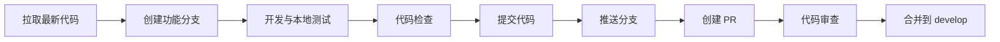

# 开发流程指南

> RiskAgent-FrontEnd 日常开发工作流指南，涵盖从分支创建到代码提交的完整流程。

## 开发工作流

### 标准开发流程



### 详细步骤

```bash
# 1. 拉取最新代码
git checkout develop
git pull upstream develop

# 2. 创建功能分支
git checkout -b feature/your-feature-name

# 3. 开发完成后，运行检查
npm run lint
npm run build

# 4. 暂存并提交（遵循 Conventional Commits）
git add -A
git commit -m "feat(scope): 简要描述"

# 5. 推送分支
git push origin feature/your-feature-name

# 6. 在 GitHub 上创建 PR 到 develop 分支
```

## 代码组织规范

### 组件开发顺序

1. **先定义类型** — 在 `src/types/` 中定义 Props 和数据接口
2. **再写 Store** — 如涉及状态管理，先在 `src/store/` 中定义 Store
3. **然后写组件** — 从基础组件到业务组件逐层构建
4. **最后写 Hooks** — 提取可复用逻辑到 `src/hooks/`

### 文件组织原则

- 每个组件一个目录，包含组件文件和样式文件
- 组件目录名使用 kebab-case（如 `agent-node/`）
- 组件文件名使用 kebab-case（如 `agent-node.tsx`）
- 样式文件使用 CSS Module（如 `agent-node.module.css`）
- 同领域类型集中在一个文件（如 `types/agent.ts`）

## 调试技巧

### React DevTools

安装 [React Developer Tools](https://react.dev/learn/react-developer-tools) 浏览器扩展：

- **Components 面板**：查看组件树、Props 和状态
- **Profiler 面板**：性能分析，定位渲染瓶颈

### 网络面板调试

在 Chrome DevTools 的 Network 面板中：

- 筛选 `EventStream` 类型查看 SSE 连接
- 查看 SSE 事件的实时推送数据
- 检查请求头和响应头中的 `Content-Type: text/event-stream`

### SSE 调试技巧

```typescript
// 开发环境下打印 SSE 消息
const debugSSE = (message: SSEMessage) => {
  if (import.meta.env.DEV) {
    console.log('[SSE]', message.type, message)
  }
}
```

### 断点调试

在 VSCode 中创建 `.vscode/launch.json`：

```json
{
  "version": "0.2.0",
  "configurations": [
    {
      "type": "chrome",
      "request": "launch",
      "name": "Debug RiskAgent",
      "url": "http://localhost:5173",
      "webRoot": "${workspaceFolder}/src"
    }
  ]
}
```

## 组件开发模板

### 基础组件模板

```typescript
// components/base/button/button.tsx
import { type ButtonHTMLAttributes } from 'react'
import styles from './button.module.css'

interface ButtonProps extends ButtonHTMLAttributes<HTMLButtonElement> {
  variant?: 'primary' | 'secondary' | 'ghost'
  size?: 'small' | 'medium' | 'large'
}

export function Button({
  variant = 'primary',
  size = 'medium',
  className,
  children,
  ...props
}: ButtonProps) {
  const classes = [
    styles.button,
    styles[variant],
    styles[size],
    className,
  ].filter(Boolean).join(' ')

  return (
    <button className={classes} {...props}>
      {children}
    </button>
  )
}
```

### 业务组件模板

```typescript
// components/business/agent-node/agent-node.tsx
import { useAgentStore } from '../../../store/agent-store'
import type { Agent } from '../../../types/agent'
import styles from './agent-node.module.css'

interface AgentNodeProps {
  agentId: string
  onSelect?: (agentId: string) => void
}

export function AgentNode({ agentId, onSelect }: AgentNodeProps) {
  const agent = useAgentStore((state) => state.agents[agentId])

  if (!agent) return null

  const handleClick = () => onSelect?.(agentId)

  return (
    <div className={styles.node} onClick={handleClick}>
      <span className={styles.role}>{agent.role}</span>
      <span className={styles.status}>{agent.status}</span>
    </div>
  )
}
```

## 状态管理最佳实践

### Store 设计原则

1. **单一职责** — 每个 Store 只管理一个领域
2. **扁平结构** — 避免深层嵌套状态，使用 Map/Record 提高访问效率
3. **选择器优化** — 使用细粒度选择器避免不必要的重渲染
4. **不可变更新** — 使用展开运算符或 Immer 保持状态不可变

### 选择器使用示例

```typescript
// ❌ 不推荐：订阅整个 Store，任何状态变更都会触发重渲染
const store = useAgentStore()

// ✅ 推荐：只订阅需要的字段
const agent = useAgentStore((state) => state.agents[agentId])
const activeIds = useAgentStore((state) => state.activeAgentIds)
```

### 跨 Store 通信

避免直接引用其他 Store，通过事件或中间件解耦：

```typescript
// store/task-store.ts
import { useChatStore } from './chat-store'

// 在任务完成时通知对话 Store
const completeTask = (taskId: string) => {
  set((state) => ({
    tasks: {
      ...state.tasks,
      [taskId]: { ...state.tasks[taskId], status: 'completed' },
    },
  }))

  // 跨 Store 通知（谨慎使用，仅限必要场景）
  useChatStore.getState().addMessage({
    id: crypto.randomUUID(),
    source: 'system',
    content: `任务 ${taskId} 已完成`,
    isStreaming: false,
    timestamp: Date.now(),
  })
}
```

环境搭建请参考 [环境搭建指南](setup.md)，编码规范详见 [编码规范](../standards/coding-conventions.md)。
