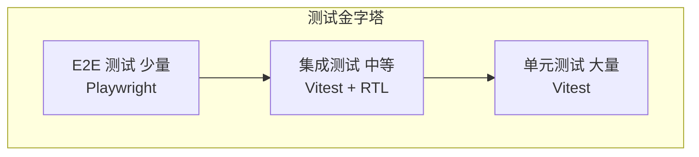

# 测试规范

> RiskMonitor-FrontEnd 测试策略与规范文档。本文定义了测试分层、工具选型、文件组织和编写标准。

## 测试策略

### 测试金字塔



### 测试分层

| 层级 | 范围 | 工具 | 占比目标 | 运行频率 |
|------|------|------|----------|----------|
| 单元测试 | 函数、Hook、Store、工具 | Vitest | 70% | 每次提交 |
| 集成测试 | 组件组合、模块交互 | Vitest + RTL | 20% | 每次提交 |
| E2E 测试 | 完整用户流程 | Playwright | 10% | 每日/发布前 |

## 测试工具选型

### Vitest

- **用途**：单元测试和集成测试的运行器
- **选择理由**：与 Vite 原生集成，零配置，速度快
- **配置文件**：`vitest.config.ts`

```typescript
// vitest.config.ts
import { defineConfig } from 'vitest/config'
import react from '@vitejs/plugin-react'

export default defineConfig({
  plugins: [react()],
  test: {
    environment: 'jsdom',
    globals: true,
    setupFiles: ['./src/test/setup.ts'],
    coverage: {
      provider: 'v8',
      reporter: ['text', 'html'],
      thresholds: {
        statements: 80,
        branches: 75,
        functions: 80,
        lines: 80,
      },
    },
  },
})
```

### React Testing Library (RTL)

- **用途**：React 组件测试
- **选择理由**：以用户视角测试组件，不依赖实现细节

### Playwright

- **用途**：端到端测试
- **选择理由**：跨浏览器支持，API 现代化，自动等待

## 测试文件组织规范

### 文件命名

- 测试文件与源文件同目录
- 命名格式：`<source-name>.test.ts(x)`
- E2E 测试放在 `e2e/` 目录，命名：`<flow-name>.spec.ts`

### 目录结构

```
src/
├── components/
│   └── base/
│       └── button/
│           ├── button.tsx
│           └── button.test.tsx      # 组件测试
├── hooks/
│   ├── use-sse.ts
│   └── use-sse.test.ts              # Hook 测试
├── store/
│   ├── chat-store.ts
│   └── chat-store.test.ts           # Store 测试
├── utils/
│   ├── format.ts
│   └── format.test.ts               # 工具函数测试
└── test/
    └── setup.ts                     # 测试全局配置
e2e/
├── chat-flow.spec.ts                # 对话流程 E2E
└── canvas-drag.spec.ts              # 画布拖拽 E2E
```

## 测试覆盖率目标

| 维度 | 目标 | 说明 |
|------|------|------|
| 语句覆盖率 | >= 80% | 执行的语句比例 |
| 分支覆盖率 | >= 75% | 条件分支的覆盖比例 |
| 函数覆盖率 | >= 80% | 调用的函数比例 |
| 行覆盖率 | >= 80% | 执行的代码行比例 |

### 优先测试范围

1. **Store** — 状态管理逻辑（100% 覆盖率目标）
2. **Hooks** — 自定义 Hook 逻辑（90% 覆盖率目标）
3. **Utils** — 工具函数（100% 覆盖率目标）
4. **业务组件** — 核心交互逻辑（80% 覆盖率目标）
5. **基础组件** — 通用 UI 组件（70% 覆盖率目标）

## 测试编写示例

### 单元测试 - Store

```typescript
// store/chat-store.test.ts
import { describe, it, expect, beforeEach } from 'vitest'
import { useChatStore } from './chat-store'

describe('ChatStore', () => {
  beforeEach(() => {
    useChatStore.getState().clearMessages()
  })

  it('应添加新消息', () => {
    const { addMessage } = useChatStore.getState()

    addMessage({
      id: 'msg-1',
      source: 'user',
      content: '你好',
      isStreaming: false,
      timestamp: Date.now(),
    })

    expect(useChatStore.getState().messages).toHaveLength(1)
    expect(useChatStore.getState().messages[0].content).toBe('你好')
  })

  it('应追加 token 到流式消息', () => {
    const { addMessage, appendToken } = useChatStore.getState()

    addMessage({
      id: 'msg-1',
      source: 'agent',
      content: '',
      isStreaming: true,
      timestamp: Date.now(),
    })

    appendToken('msg-1', '你')
    appendToken('msg-1', '好')

    expect(useChatStore.getState().messages[0].content).toBe('你好')
  })
})
```

### 集成测试 - 组件

```typescript
// components/base/button/button.test.tsx
import { describe, it, expect, vi } from 'vitest'
import { render, screen, fireEvent } from '@testing-library/react'
import { Button } from './button'

describe('Button', () => {
  it('应渲染按钮文字', () => {
    render(<Button>提交</Button>)
    expect(screen.getByRole('button', { name: '提交' })).toBeDefined()
  })

  it('点击时触发 onClick', () => {
    const handleClick = vi.fn()
    render(<Button onClick={handleClick}>提交</Button>)

    fireEvent.click(screen.getByRole('button'))
    expect(handleClick).toHaveBeenCalledTimes(1)
  })

  it('disabled 时不可点击', () => {
    const handleClick = vi.fn()
    render(<Button disabled onClick={handleClick}>提交</Button>)

    fireEvent.click(screen.getByRole('button'))
    expect(handleClick).not.toHaveBeenCalled()
  })
})
```

### E2E 测试示例

```typescript
// e2e/chat-flow.spec.ts
import { test, expect } from '@playwright/test'

test('用户发送消息后应收到流式回复', async ({ page }) => {
  await page.goto('http://localhost:5173/workspace/chat')

  await page.fill('[data-testid="chat-input"]', '帮我创建一个 React 组件')
  await page.click('[data-testid="send-button"]')

  // 验证用户消息已显示
  await expect(page.locator('text=帮我创建一个 React 组件')).toBeVisible()

  // 验证智能体回复开始流式输出
  await expect(page.locator('[data-testid="agent-message"]')).toBeVisible({ timeout: 10000 })
})
```

## 测试运行命令

```bash
# 运行所有单元/集成测试
npx vitest

# 运行测试并生成覆盖率报告
npx vitest run --coverage

# 以 watch 模式运行
npx vitest watch

# 运行 E2E 测试
npx playwright test

# 查看 E2E 测试报告
npx playwright show-report
```

编码规范详见 [编码规范](coding-conventions.md)，开发流程详见 [开发流程指南](../guides/development.md)。
